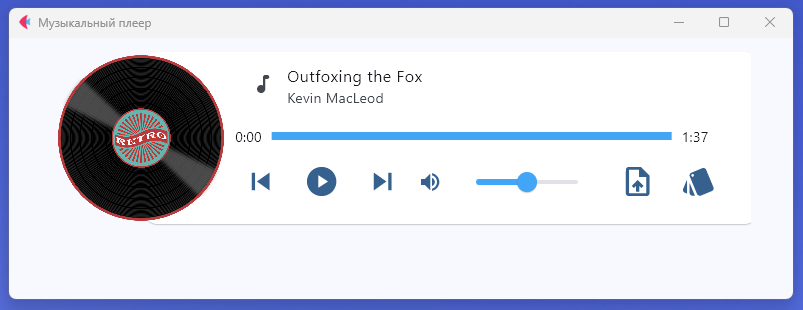
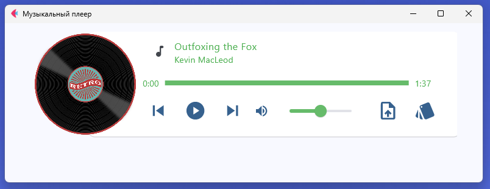
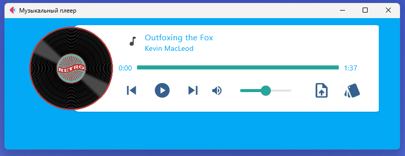
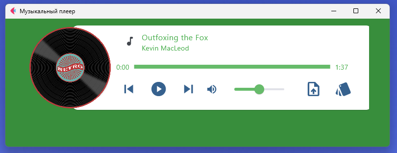

# Music-Player-Flet



## Описание приложения:
Приложение музыкального проигрывателя, созданное с помощью Flet Framework.


### 📖 Структура проекта:
```
music_player_flet/
├── assets/
│   ├── album.png
│   └── album0.png
│
├── img/
│   ├── green.png
│   ├── light_blue.png
│   ├── text_green.png
│   └── light.png
│
├── sounds/
│   ├── 14-john-powell-the-villa---rycar-dnya-knight-and-day-2010-th.mp3
│   ├── outfoxing.mp3
│   ├── param_viper.mp3
│   ├── perfect-beauty-191271.mp3
│   ├── reflected-light-147979.mp3
│   ├── waterfall-140894.mp3
│   └── track_drums.mp3
│
├── .gitignore
├── LICENCE
├── main.py
├── requirements.txt
└── README.md
```

#### Установка всех пакетов из файла requirements.txt с помощью pip и Python:

<code>pip install -r requirements.txt</code>

#### Скриншоты:





### 🛡 Лицензия

Этот проект лицензирован под лицензией MIT. Подробности смотрите в файле LICENSE.

### 💡 Идеи для улучшений
1. 1
2. 2
3. 3

#### 💼 Автор: Дуплей Максим Игоревич
#### 📲 Telegram: @QuadD4rv1n7
#### 📅 Дата: 18.08.2024 